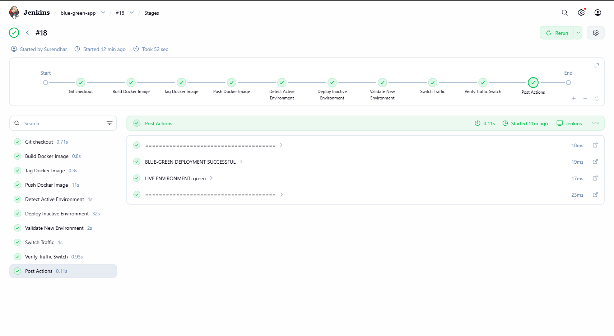
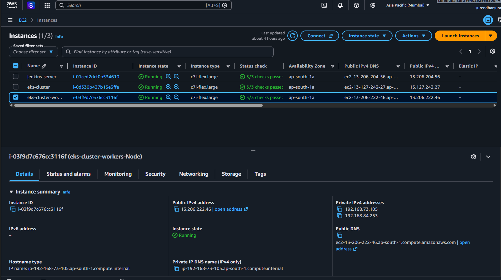
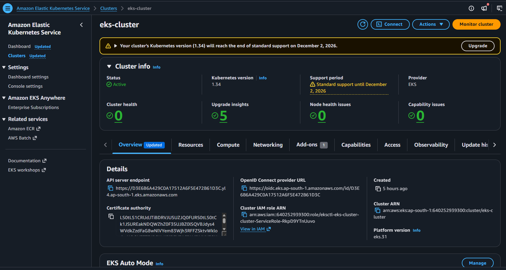
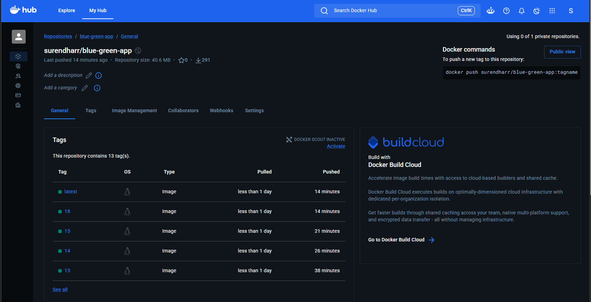

# Zero-Downtime Blue-Green Deployment using Kubernetes

## 📌 Overview

This project demonstrates a **Blue-Green deployment strategy** for a static web application using **Docker, Kubernetes, Jenkins, and AWS EKS**.

Two environments, **Blue** and **Green**, are maintained. Jenkins automatically detects the currently active environment, deploys the new version to the inactive environment, validates it, and switches traffic to the new version.

This approach helps achieve **zero-downtime deployments** and provides quick rollback by switching traffic back to the previous environment.

---

## 🏗️ Architecture

```text
Developer
   |
   | git push
   v
GitHub
   |
   | Webhook
   v
Jenkins (EC2)
   |
   | Docker Build
   v
Docker Hub
   |
   | New Image
   v
AWS EKS
   |
   +-------------------+
   |                   |
   v                   v
Blue Deployment    Green Deployment
   |                   |
   +---------+---------+
             |
             v
      NodePort Service
             |
             v
          Browser
```
🛠️ Technologies Used
AWS EKS
Amazon EC2
Kubernetes
Docker
Docker Hub
Jenkins
Git & GitHub
GitHub Webhooks
Linux
Nginx
YAML

📂 Project Structure
```
blue-green-app/
│
├── k8s/
│   ├── blue-deployment.yaml
│   ├── green-deployment.yaml
│   └── service.yaml
│
├── Dockerfile
├── index.html
├── timer.html
├── tooplate-ivory-script.js
├── tooplate-ivory-style.css
├── deployment.yaml
└── README.md
```

🔄 Deployment Flow
```
Code Push
    ↓
GitHub Webhook
    ↓
Jenkins Pipeline
    ↓
Build Docker Image
    ↓
Push Image to Docker Hub
    ↓
Detect Active Environment
    ↓
Deploy to Inactive Environment
    ↓
Validate Deployment
    ↓
Switch Service Traffic
    ↓
Verify Traffic
    ↓
New Version LIVE
```

🔵🟢 Blue-Green Deployment

Two environments are maintained:
```
Blue   → Current LIVE version
Green  → New version
```
If Blue is currently live:
```
Blue  → LIVE
Green → New Version
          ↓
       Validate
          ↓
   Service → Green
          ↓
Green → LIVE
```
The next deployment automatically works in the opposite direction:
```
Green → LIVE
Blue  → New Version
          ↓
       Validate
          ↓
   Service → Blue
          ↓
Blue → LIVE
```
Jenkins automatically detects which environment is currently active using the Kubernetes Service selector.

🚀 Jenkins CI/CD Pipeline

The Jenkins pipeline performs these stages:

Git Checkout
Build Docker Image
Tag Docker Image
Push Docker Image
Detect Active Environment
Deploy Inactive Environment
Validate New Environment
Switch Traffic
Verify Traffic Switch

Docker Image Tagging

Jenkins uses the build number to create versioned Docker images:
```
surendharr/blue-green-app:<BUILD_NUMBER>
```
Example:
```
surendharr/blue-green-app:12
surendharr/blue-green-app:13
surendharr/blue-green-app:14
```
Images are pushed to Docker Hub before being deployed to Kubernetes.

☸️ Kubernetes Implementation

The application runs on an AWS EKS cluster.

Blue Deployment
```
Deployment: blue-deployment
Replicas: 2
Version: blue
Container: blue-green-app
```
Green Deployment
```
Deployment: green-deployment
Replicas: 2
Version: green
Container: green-app
```

Service

A Kubernetes NodePort Service exposes the application.

The Service selector determines which environment receives traffic.

For Blue:
```
selector:
  app: blue-green-app
  version: blue
```
For Green:
```
selector:
  app: blue-green-app
  version: green
```
Changing the version selector switches traffic between Blue and Green.

❤️ Health Checks

Both environments use Kubernetes health probes.
```
Readiness Probe
readinessProbe:
  httpGet:
    path: /
    port: 80
```
Checks whether the Pod is ready to receive traffic.
```
Liveness Probe
livenessProbe:
  httpGet:
    path: /
    port: 80
```
Helps Kubernetes detect unhealthy containers.

Jenkins also waits for the Deployment to become available before switching traffic.

🔗 GitHub Webhook

GitHub Webhooks are configured to automatically trigger the Jenkins pipeline whenever code is pushed to the repository.
```
git push
   ↓
GitHub
   ↓
Webhook
   ↓
Jenkins
   ↓
Pipeline starts automatically
```
Jenkins is configured with:

GitHub hook trigger for GITScm polling

This removes the need to manually start the Jenkins build after every code change.

☁️ AWS Infrastructure
```
EC2 #1
└── Jenkins
    ├── Docker
    ├── AWS CLI
    └── kubectl

AWS EKS
└── Worker Node
    ├── Blue Deployment
    └── Green Deployment
```
Jenkins connects to the EKS cluster using AWS credentials and updates the Kubernetes resources.
## 📸 Project Output

### Application

Deployed web application running successfully through Kubernetes.


### Jenkins Pipeline

Jenkins automatically builds the Docker image, pushes it to Docker Hub, deploys the inactive environment, validates it, and switches traffic.



### AWS EC2

EC2 instance used for Jenkins and DevOps tools.



### AWS EKS Cluster

Kubernetes cluster running the Blue and Green deployments.



### Docker Registry

Docker images created by Jenkins and pushed to Docker Hub.



### Kubernetes Commands

Kubernetes deployments, Pods, Services, and Blue-Green environment status.


### Traffic Switches

